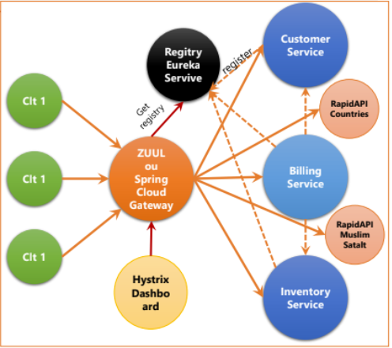
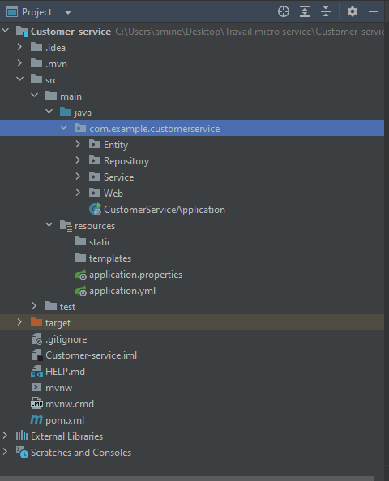
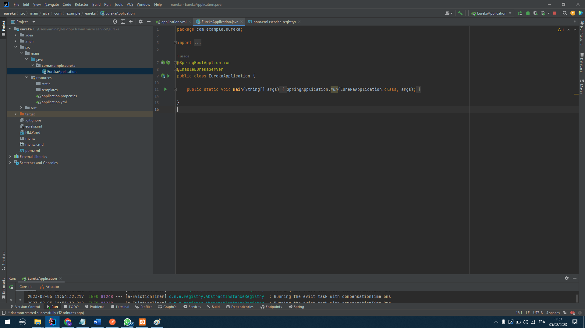
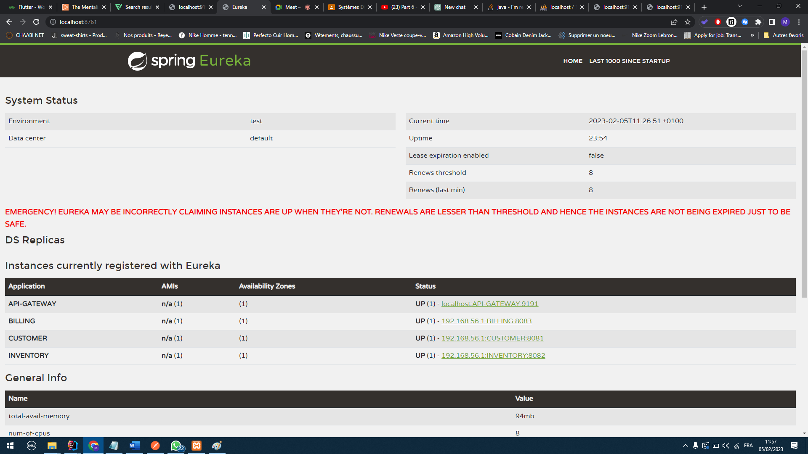
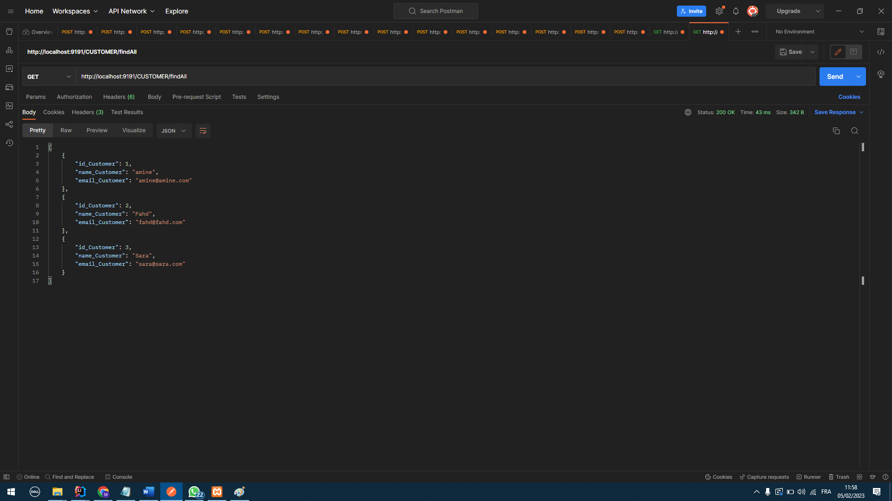
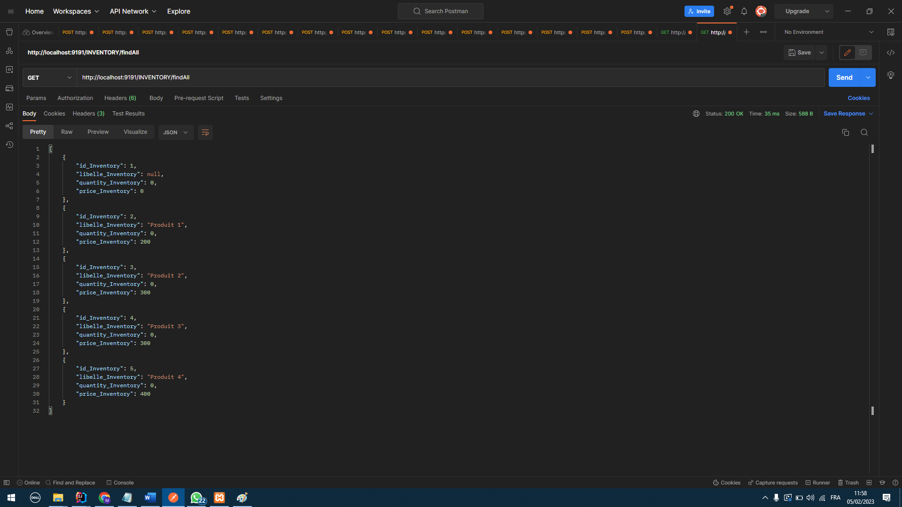
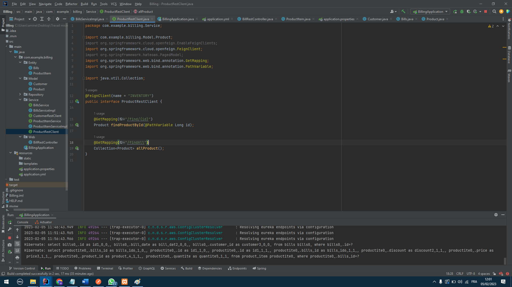
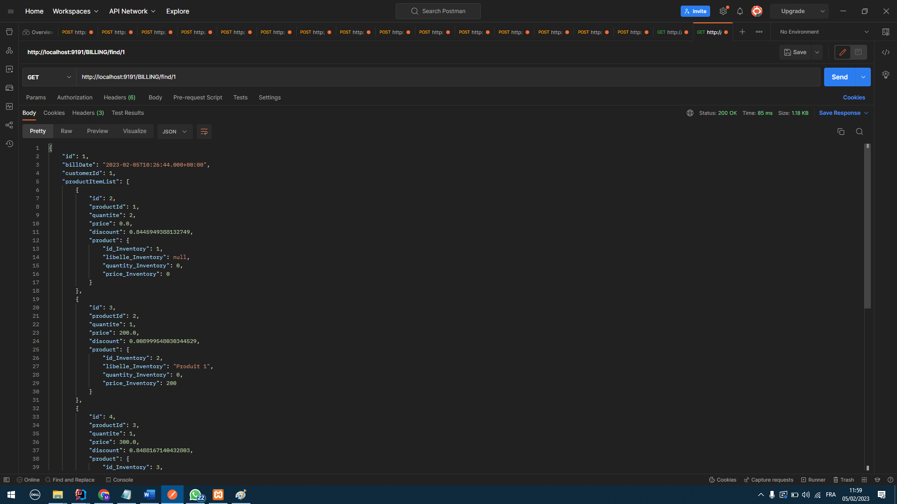
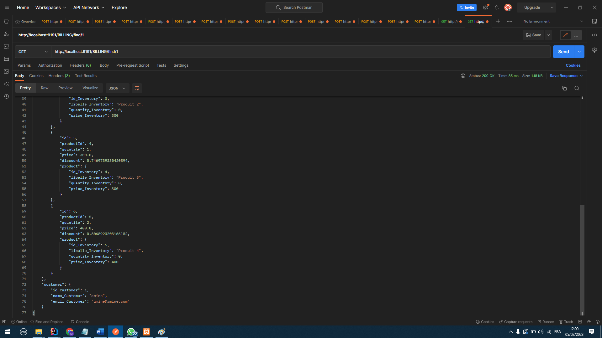

<h1>Architecture MICRO-SERVICE avec une communication synchrone "OPEN-FEIGN"</h1>

Dans ce projet nous allons voir comment créer une architecture micro-service en reliant un micro service customer,inventory et billing

Pour reliées ses micros-services il va falloir configurer la gateway pour connaitre le chemin de chaque micro service et configurer le registre eureka server pour connaitre l'emplacement et le nom de chaque micro service

<h2>La configuration de notre architecture</h2>

<h3>Pour commencer on crée le premier micro service qui est CUSTOMER</h3>

CUSTOMER est crée sous 4 couches la couches <ul><li>Entity</li><li>Repository</li><li>Service</li><li>Web</li></ul>

<h3>On crée le deuxième micro service qui est INVENTORY</h3>

INVENTORY est crée sous 4 couches la couches <ul><li>Entity</li><li>Repository</li><li>Service</li><li>Web</li></ul>

<h3>On crée la gateway</h3>

Il y a deux types de configuration de la gateway: <ul><li>Configuration statique</li><li>Configuration dynamique</li></ul>

Dans cet exemple nous avons opté pour une configuration dynamique

<h3>On crée le le registre eureka server</h3>

le registre eureka server est configurer de la manièere suivante:

Et dans chaque service "CUSTOMER, INVENTORY et la GATEWAY" on crée un ficher application.yml pour donner un nom à nos micros services

<h5>Exemple:</h5>

Si on test la couche web de chaque micro service avec la gateway, on ecrit juste le nom du micro service configurer dans spring eureka et la gateway s'occupe de l'acheminement vers le service

la premier phase est complétée

<h2>Création d'un troisième micro service "BILLING"</h2>

Le service BILLING regroupe les information des deux autres micro service INVENTORY et CUSTOMER

Pour faire cela, on utilise le framework OPENFEIGN, pour faire cela 

BILLING est crée sous 5 couches la couches <ul><li>Entity</li><li>Model</li><li>Repository</li><li>Service</li><li>Web</li></ul>

Dans la couche model on crée deux classes inventory et customer et dans billing on sauvegarde juste les id des customers et des produits

Quand on veut afficher une facture on a juste a prendre l'id du customer et les id des produits et on les cherches dans les micros services "INVENTORY et CUSTOMER"

Pour faire cela: 

<h4>Quand on cherche une facture</h4>

Comme on le voit dans les deux captures quand on affiche la facture avec l'id 1

BILLING va cherhcer les informations sur le customer son et email et cherche pour chaque id d'un produit son prix, son nom et la quantté dans le stock
